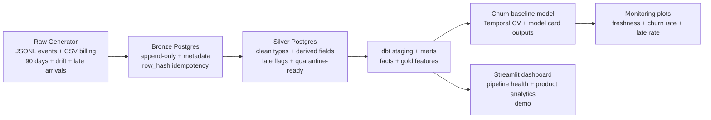

<p align="center">
  
</p>

***
# JANUS
***

**Unified SaaS Analytics Platform**  
*Data Engineering • Analytics • Predictive Modeling*

***
JANUS is intentionally designed to showcase the following connected processes:

**data generation → ingestion → bronze/silver → dbt marts → ML (temporal CV) → monitoring → lightweight dashboard**. 

It demonstrates production-style data engineering, analyst-grade reporting, and applied data science in a single harmonious and coherent platform.

---

## What JANUS does

### Data Engineering
- Generates **90 days** of realistic synthetic product telemetry (JSONL) and billing events (CSV).
- Simulates **late arriving events** and **schema drift** (e.g., `props.ui_variant` appears only in later days).
- Loads raw data into **Postgres** bronze layer with **idempotency** (row hashes, constraints, indexes).
- Transforms bronze to silver with quarantine-ready patterns (clean types, derived fields, late flags).

### Analytics Engineering (dbt)
- Builds staging and fact/gold models, including:
  - Daily product usage KPIs
  - Daily billing starts/cancels/upgrades
  - Subscription activity and churn labels/features
- Includes dbt tests and docs generation.

### Machine Learning
- Trains a baseline churn classifier (Logistic Regression) using **temporal cross-validation**.
- Writes model artifacts and fold metrics to `reports/model_cards/`.
- Generates monitoring plots (drift/health style checks) to show operational thinking.

### Dashboard
- A small Streamlit dashboard exists for demonstration only.
- The dashboard is not the primary focus of JANUS; the pipeline and evaluation discipline is.

---

## Repo structure

```text
.
├── README.md
├── assets
│   └── JANUS.png
├── dashboard
│   ├── JANUS_dash.py
│   ├── __init__.py
│   ├── assets
│   ├── lib
│   │   ├── __init__.py
│   │   ├── charts.py
│   │   ├── db.py
│   │   └── queries.py
│   └── pages
│       ├── __init__.py
│       ├── pipeline_health.py
│       └── product_analytics.py
├── data
│   ├── raw
│   │   ├── billing
│   │   └── events
│   └── snapshots
├── dbt
│   ├── janus_dbt
│   │   ├── analyses
│   │   ├── dbt_project.yml
│   │   ├── logs
│   │   ├── macros
│   │   ├── models
│   │   │   ├── marts
│   │   │   └── staging
│   │   ├── packages.yml
│   │   ├── seeds
│   │   ├── snapshots
│   │   ├── target
│   │   └── tests
│   │       ├── unique_fct_subscriptions_daily_grain.sql
│   │       ├── unique_gold_churn_labels_daily_grain.sql
│   │       ├── unique_gold_user_features_daily_grain.sql
│   │       └── valid_late_rate_7d.sql
│   └── profiles.yml
├── docker
│   ├── airflow
│   │   └── dags
│   └── docker-compose.yml
├── logs
├── models
│   ├── churn
│   │   ├── model_report_churn_baseline.md
│   │   └── train_baseline.py
│   └── ltv
├── notebooks
│   └── analytics
│       ├── churn_eda.ipynb
│       ├── model_monitoring.ipynb
│       └── reports
│           └── figures
├── pipelines
│   ├── generate
│   │   ├── generate_billing.py
│   │   └── generate_raw.py
│   ├── ingest
│   │   ├── bronze_idempotency.py
│   │   ├── bronze_to_silver_billing.py
│   │   ├── bronze_to_silver_events.py
│   │   ├── create_bronze_tables.py
│   │   ├── create_silver_billing_tables.py
│   │   ├── create_silver_tables.py
│   │   ├── load_billing_to_bronze.py
│   │   └── load_events_to_bronze.py
│   ├── quality
│   └── utils
│       └── db.py
├── pyproject.toml
├── reports
│   ├── model_cards
│   ├── pipeline_runs
│   └── wbr
└── src
    └── janus
        ├── __init__.py
        ├── __pycache__
        │   ├── __init__.cpython-311.pyc
        │   └── db.cpython-311.pyc
        └── db.py
```

---

## Architecture



---

## Setup

### Conda environment

Python version and dependencies encolsed in `pyproject.toml`.

```bash
conda create -n janus python=3.11 -y
conda activate janus 
pip install -e .
```

***

### Start services

Postgres exposted on `localhost:5433`.

```bash
docker compose -p janus -f docker/docker-compose.yml up -d
docker compose -p janus -f docker/docker-compose.yml ps
```

---

## Pipeline run

### Generate raw data

Example: generating 90 days or raw data

```bash
python pipelines/generate/generate_raw.py --days 90 --events-per-day 800 --users 500 --drift-day 40
python pipelines/generate/generate_billing.py --days 90 --users 500
```

**Temporal depth matters**, short temporal windows (e.g. 14 days) causers instability in churn labels and model evaluation.

***

### Create bronze and silver tables

```bash
python pipelines/ingest/create_bronze_tables.py
python pipelines/ingest/create_silver_tables.py
python pipelines/ingest/create_silver_billing_tables.py
python pipelines/ingest/bronze_idempotency.py
```

***

### Load raw data to bronze layer


```bash
python pipelines/ingest/load_events_to_bronze.py --limit-files 0
python pipelines/ingest/load_billing_to_bronze.py --limit-files 0
```

***

### Tranform bronze to silver

```bash
python pipelines/ingest/bronze_to_silver_events.py
python pipelines/ingest/bronze_to_silver_billing.py
```

***

### Run dbt models and tests

**Needs to be ran from `dbt/janus_dbt`.**

```bash
cd dbt/janus_dbt
DBT_PROFILES_DIR=../ dbt debug
DBT_PROFILES_DIR=../ dbt run
DBT_PROFILES_DIR=../ dbt test
DBT_PROFILES_DIR=../ dbt docs generate
DBT_PROFILES_DIR=../ dbt docs serve
```

***

### Train churn baseline model

Time-aware temporal cross validation logistic regression model.

Run from root directroy:

```bash
PYTHONPATH=src python models/churn/train_baseline.py
```

Outputs written to: 

- `reports/model_cards/churn_baseline_v1_metrics.json`
- `reports/model_cards/churn_baseline_v1_temporal_cv_folds.csv`
- `reports/model_cards/churn_baseline_v1_coefficients.csv`

***

**Note:** Churn is a rare occurance in the synthetic data. This means a high class imbalance. Therefore, **PR AUC will appear low even when working as intended**.

JANUS serves to demonstrate evaluation discipline with temporal cross validation, fold stability checks, etc... not leaderboard chasing.

---

## Model monitoring

Monitoring plots are produced under:

- `reports/model_cards/plots/`

These include:

- data freshness / temporal coverage
- churn rate by day
- late-arrival rate trends
- coefficient stability cues (baseline interpretability)

---

## Streamlit dashboard

**Run pipeline and dbt first**

```bash
PYTHONPATH=. streamlit run dashboard/JANUS_dash.py
```

---

## Future extensions
- Add orchestration (Airflow DAG) for daily runs.
- Add a stronger model (XGBoost) + probability calibration.
- Add drift + data quality alerts (PSI, missingness spikes, schema changes).
- Add SHAP explanations and segment dashboards (plan/channel/country).

---